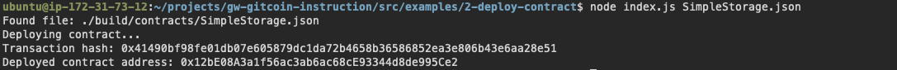

# Gitcoin: 2) Deploy A Simple Ethereum Smart Contract On Polyjuice #

Screenshot of the deployes a smart contract

Transaction hash: **0x41490bf98fe01db07e605879dc1da72b4658b36586852ea3e806b43e6aa28e51**

Deployed contract address: **0x12bE08A3a1f56ac3ab6ac68cE93344d8de995Ce2**
